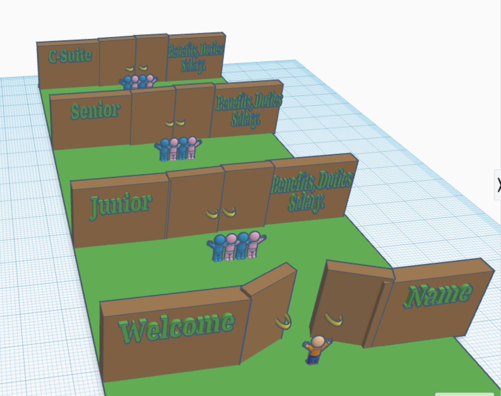

**"Path to Success - Career Advancement Journey"**  [[[[ROUGH DRAFT 1]]]

**Overview:**

Our innovative 3D model, titled "Path to Success," is designed to provide new employees with a clear and engaging visualization of their potential career advancement within our company. This model serves as a dynamic guide, illustrating the journey from entry-level positions to the heights of the C-suite.

**Design Concept:**

Structure: The model is structured as a series of rooms connected by doors, each representing a significant career milestone. Employees start at the beginning of this pathway and progress through each room.

**Progression Stages:**

Entry-Level: The journey begins in the first room, symbolizing the starting point in the company.

Junior Level: Moving through the first door, the employee enters the junior level, signifying initial growth and skill development.

Senior Level: The next door leads to the senior level, representing advanced responsibilities and mastery of skills.

C-Suite: The final door opens to the C-suite, the pinnacle of career advancement, symbolizing leadership and strategic influence.

**Information Presentation:**

Left Side (Doors): Each door is labeled with the position's title. As one progresses, the doors represent advancements and new opportunities.
Right Side (Details): Adjacent to each door, on the right, key details are displayed:
Salary: Information about the salary range for each position.
Benefits: A summary of the benefits associated with each level.
Duties: Brief descriptions of the responsibilities and roles at each stage.

**Purpose and Usage:**

Orientation Tool: Ideal for new employee orientations, offering a tangible representation of career paths in the company.
Motivational Aid: Serves as a motivational tool, showing employees the potential growth and rewards that await them.
Career Planning: Assists employees in visualizing and planning their career trajectory within the organization.
Current Status:
This is a rough draft of the model, designed to provide a basic conceptual framework. We are open to feedback and further customization to better suit our company's specific career structure and culture.

